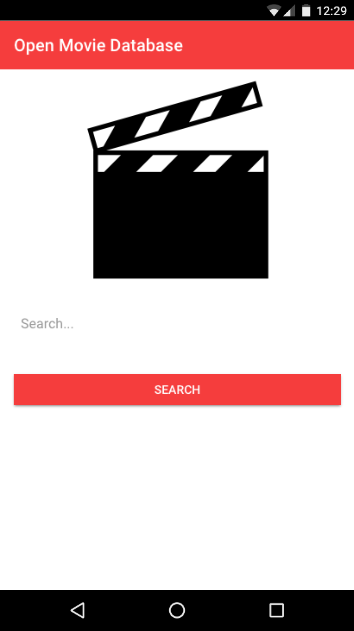
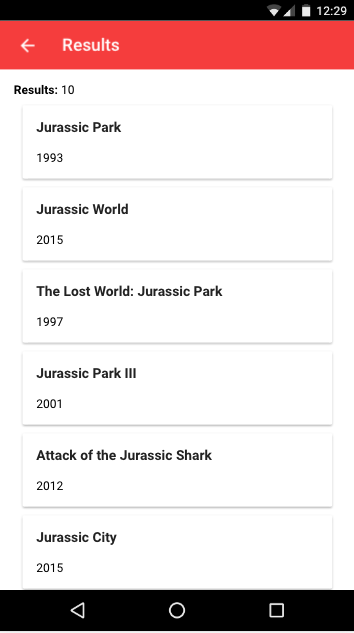
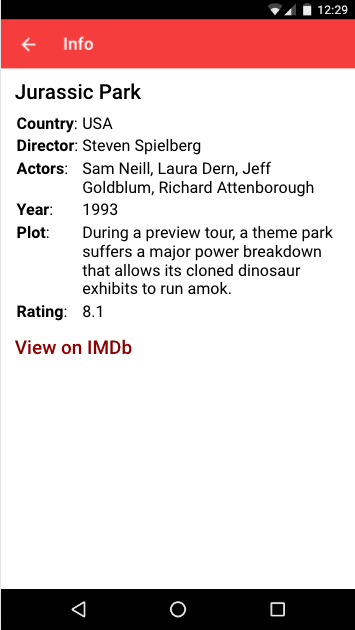

# OpenMovieDatabase

An Ionic client for OpenMovieDatabase written in Angular 2.

OpenMovieDatabase (OMDb) uses OMDbAPI (http://www.omdbapi.com/)

### Development

If you want to compile and use it, please install before the following Cordova plugin:

* cordova-plugin-whitelist

### Screenshots

